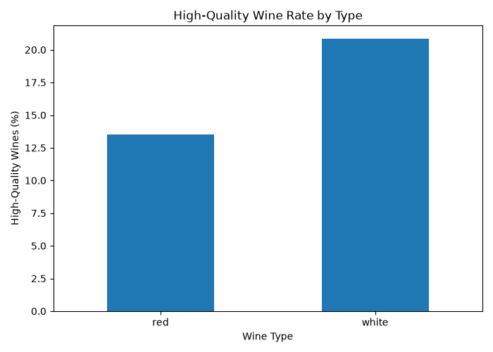
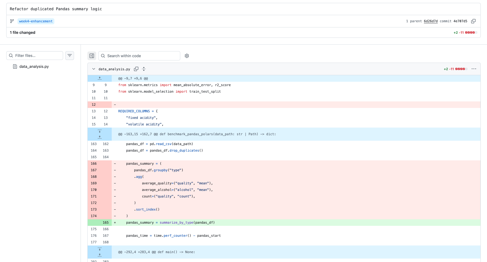
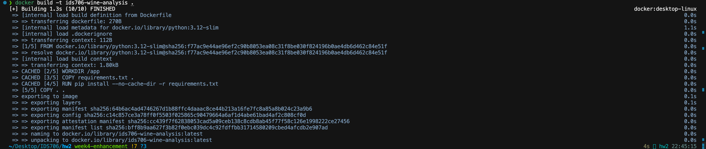
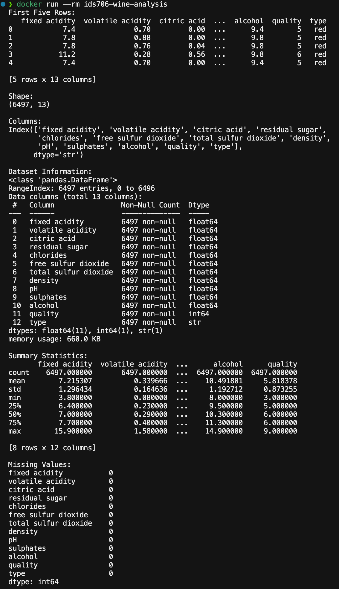
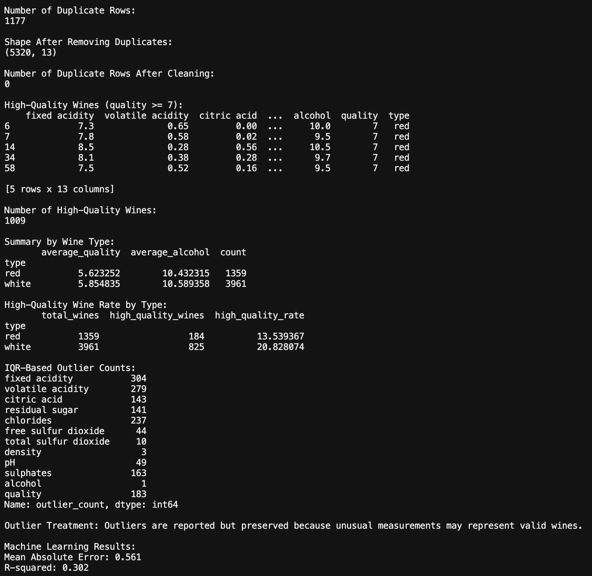
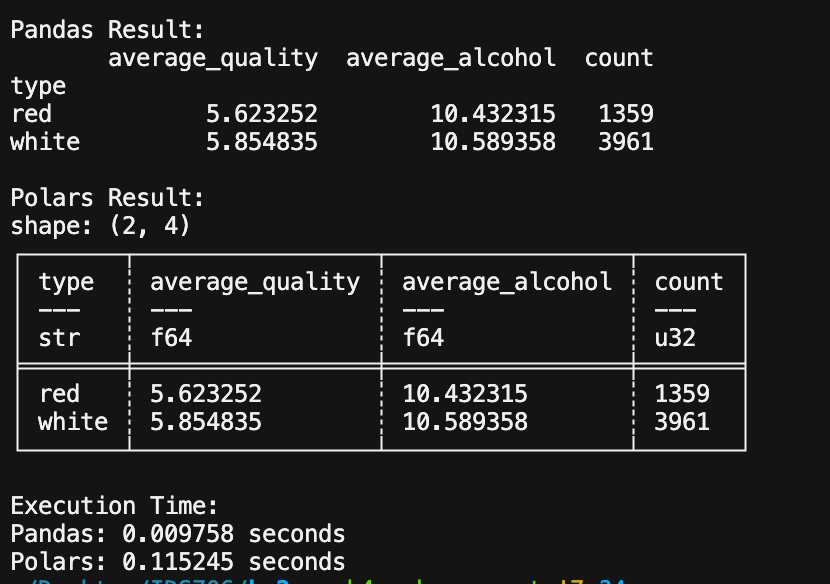

# Wine Quality Data Analysis, Testing, and Reproducibility

[](https://github.com/hanhan572/ids706-hw2/actions/workflows/tests.yml)

## Project Overview

This project analyzes a combined red and white wine-quality dataset and builds a reproducible workflow for data cleaning, exploratory analysis, visualization, and machine learning.

Across the three-week project, the repository was extended with automated testing, continuous integration, code-quality checks, Docker containerization, refactoring, outlier analysis, and an additional wine-quality analysis.

## Problem Statement

Wine quality may be related to measurable physicochemical characteristics such as alcohol content, acidity, sulphates, and density.

This project investigates:

- differences between red and white wines in average quality and alcohol content
- the proportion of high-quality wines for each wine type
- the relationship between alcohol content and wine quality
- whether physicochemical features can predict wine quality using Linear Regression

The goal is to make the analysis not only informative, but also reliable, testable, and reproducible.

## Dataset

The original dataset contains:

- 6,497 observations
- 13 variables
- 0 missing values
- 1,177 duplicate rows

After duplicate removal, the cleaned dataset contains:

- 5,320 observations
- 13 variables
- 0 duplicate rows

The variables include physicochemical measurements such as acidity, residual sugar, chlorides, density, sulphates, and alcohol.

The target variable is `quality`, while `type` identifies red or white wine.

Source: [Red and White Wine Quality dataset on Kaggle](https://www.kaggle.com/datasets/amirmohamadrezaie/red-and-white-wine-quality)

## Data Preparation

The workflow:

1. loads the CSV file
2. validates required columns
3. checks for missing values
4. identifies duplicate observations
5. removes duplicate rows
6. reports potential outliers
7. performs analysis using the cleaned dataset

No missing-value imputation was required because the dataset contains no missing values.

### Outlier Treatment

Potential outliers are identified independently for each numeric variable using the IQR rule.

A value is reported as a potential outlier when it falls below:

```text
Q1 - 1.5 × IQR
```

or above:

```text
Q3 + 1.5 × IQR
```

Selected results from the cleaned dataset are:

| Variable | IQR Outlier Count |
|---|---:|
| Fixed acidity | 304 |
| Volatile acidity | 279 |
| Chlorides | 237 |
| Quality | 183 |
| Sulphates | 163 |
| Citric acid | 143 |
| Residual sugar | 141 |
| Alcohol | 1 |

The observations are reported but not automatically removed. Extreme physicochemical measurements may represent legitimate wines, so automatically deleting all statistical outliers could remove valid information.

## Analysis and Key Findings

### Summary by Wine Type

| Wine Type | Average Quality | Average Alcohol | Count |
|---|---:|---:|---:|
| Red | 5.623 | 10.432 | 1,359 |
| White | 5.855 | 10.589 | 3,961 |

White wines in this dataset have slightly higher average quality and average alcohol content than red wines.

### High-Quality Wine Rate

A high-quality wine is defined as:

```text
quality >= 7
```

The cleaned dataset contains 1,009 high-quality wines.

| Wine Type | Total Wines | High-Quality Wines | High-Quality Rate |
|---|---:|---:|---:|
| Red | 1,359 | 184 | 13.54% |
| White | 3,961 | 825 | 20.83% |

The proportion of high-quality wines is higher among white wines in this dataset.



### Alcohol and Wine Quality

The scatter plot below examines alcohol content and wine quality.


The visualization suggests a positive relationship between alcohol content and wine quality, although substantial overlap remains across quality levels.

## Machine Learning

A Linear Regression model predicts wine quality using the 11 numeric physicochemical variables.

The data is divided into:

- 80% training data
- 20% testing data

A fixed:

```python
random_state=42
```

is used for reproducibility.

The categorical `type` variable is excluded from the model.

### Model Results

- Mean Absolute Error: **0.561**
- R-squared: **0.302**

The predictions differ from the actual wine-quality scores by approximately 0.56 points on average.

The R-squared value indicates that the simple linear model explains approximately 30.2% of the observed variation in wine quality.

## Pandas vs. Polars

The project also compares Pandas and Polars using the same data-processing workflow:

1. load the CSV file
2. remove duplicates
3. group observations by wine type
4. calculate average quality
5. calculate average alcohol content
6. count observations

Both implementations produce equivalent grouped results, which is also verified by an automated test.

Runtime results should be interpreted cautiously because performance depends on dataset size, hardware, package versions, operation type, and startup overhead.

## Testing

The repository contains **29 automated pytest tests** covering normal behavior, edge cases, reproducibility, visualization, and complete workflow execution.

Tests cover:

- valid data loading
- missing files
- missing required columns
- duplicate removal
- preservation of unique observations
- index resetting
- default and custom filtering thresholds
- empty filtering results
- wine-type summaries
- high-quality wine-rate calculations
- IQR outlier detection
- visualization generation
- Pandas/Polars consistency
- Linear Regression training
- prediction generation
- model evaluation
- reproducible model results
- insufficient training data
- synthetic-data integration
- real-dataset integration

Run the complete suite with:

```bash
python -m pytest -v
```

## Continuous Integration

GitHub Actions automatically verifies the project.

The workflow runs on:

- pushes to `main`
- pushes to `week4-enhancement`
- pull requests targeting `main`
- a weekly scheduled run
- manual workflow dispatch

A matrix strategy runs the test suite using:

- Python 3.11
- Python 3.12

A separate code-quality job checks formatting and linting with:

```bash
python -m black --check .
python -m flake8 .
```

The current CI status is displayed by the badge at the top of this README.

## Refactoring and Code Quality

A meaningful refactoring removed duplicated Pandas summary logic.

Previously, `benchmark_pandas_polars()` repeated the same `groupby()` aggregation already implemented in `summarize_by_type()`.

The benchmark now reuses:

```python
pandas_summary = summarize_by_type(pandas_df)
```

This reduces duplication and provides a single implementation for the Pandas wine-type summary calculation.

The refactored project was verified using Black, Flake8, and the full pytest suite.

### Refactoring Diff



## Docker

The project can run inside a reproducible Docker environment based on Python 3.12.

### Build the Image

```bash
docker build -t ids706-wine-analysis .
```

### Run the Container

```bash
docker run --rm ids706-wine-analysis
```

The container installs the required Python dependencies and executes the complete wine-quality analysis.

### Docker Build Evidence



### Docker Run Evidence

The following screenshot shows the container starting successfully and loading the wine-quality dataset.



The container continues through duplicate removal, high-quality wine analysis, IQR-based outlier reporting, and machine-learning evaluation.



The final output confirms that the Pandas and Polars workflows also execute successfully and produce equivalent grouped summary results.



### What I Learned

Docker provides a reproducible execution environment that does not depend on the Python installation configured on the host computer.

This exercise also clarified the difference between a Docker image, which packages the application and its environment, and a container, which is a running instance of that image.

## Reproducibility

Several design choices support reproducibility:

- dependencies are documented in `requirements.txt`
- Python versions are tested through a CI matrix
- `random_state=42` makes the train-test split reproducible
- automated tests verify expected real-dataset outputs
- Docker provides an isolated runtime environment
- Black and Flake8 provide consistent code-quality checks

The real-data integration test verifies important expected outputs, including:

- 6,497 original observations
- 5,320 cleaned observations
- 1,009 high-quality wines
- 1,359 red wines
- 3,961 white wines
- red-wine average quality of approximately 5.623
- white-wine average quality of approximately 5.855
- MAE of approximately 0.561
- R-squared of approximately 0.302

## Setup and Usage

### Clone the Repository

```bash
git clone https://github.com/hanhan572/ids706-hw2.git
cd ids706-hw2
```

### Create a Virtual Environment

```bash
python3 -m venv .venv
```

### Activate the Environment

On macOS or Linux:

```bash
source .venv/bin/activate
```

### Install Dependencies

```bash
python -m pip install -r requirements.txt
```

### Run the Analysis

```bash
python data_analysis.py
```

### Run Tests

```bash
python -m pytest -v
```

### Run Code-Quality Checks

```bash
python -m black --check .
python -m flake8 .
```

## Project Structure

```text
ids706-hw2/
├── .github/
│   └── workflows/
│       └── tests.yml
├── data/
│   └── wine_quality_merged.csv
├── docs/
│   └── images/
│       ├── docker-build.png
│       ├── docker-run1.png
│       ├── docker-run2.png
│       ├── docker-run3.png
│       └── refactor-diff.png
├── tests/
│   ├── conftest.py
│   ├── test_analysis.py
│   ├── test_data_loading.py
│   ├── test_integration.py
│   ├── test_model.py
│   └── test_preprocessing.py
├── .dockerignore
├── .flake8
├── .gitignore
├── Dockerfile
├── data_analysis.py
├── high_quality_rate_by_type.png
├── pytest.ini
├── README.md
├── requirements.txt
├── rust_vs_python_intro.ipynb
└── wine_quality_scatter.png
```

## Tools Used

- Python 3.11 / 3.12
- Pandas
- Polars
- Matplotlib
- scikit-learn
- pytest
- Black
- Flake8
- Docker
- GitHub Actions
- Git
- GitHub
- Rust
- Jupyter Notebook