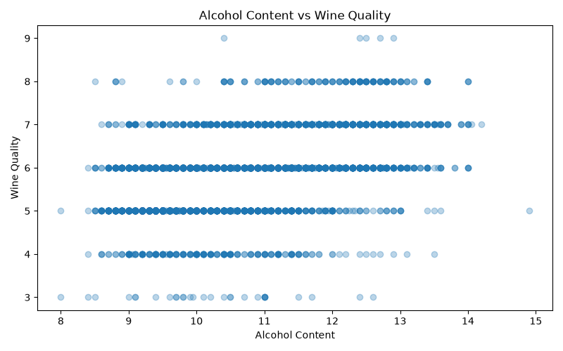

# Wine Quality Data Analysis, Testing, and Reproducibility

[](https://github.com/hanhan572/ids706-hw2/actions/workflows/tests.yml)

## Project Overview

This repository contains the first two phases of a three-week data analysis project.

The initial phase focused on exploratory data analysis and machine learning using a merged red and white wine quality dataset. The workflow includes data inspection, cleaning, filtering, grouping, visualization, Linear Regression, and a performance comparison between Pandas and Polars.

The second phase focuses on **testing, reproducibility, and reliability**. The original analysis script was refactored into reusable functions, and an automated pytest suite was added to validate individual components as well as the complete analysis workflow. GitHub Actions is used for continuous integration so that the full test suite runs automatically on pushes and pull requests.

The repository also includes a Rust Jupyter notebook exploring Rust syntax, mutability, ownership, cloning, borrowing, and memory management.

## Project Goal

The goal of this project is to explore the characteristics of red and white wines, identify patterns related to wine quality, and build a simple Linear Regression model to predict wine quality using physicochemical features.

The project also aims to make the analysis **reproducible and reliable** by:

- organizing the analysis into reusable functions
- validating core functionality with unit tests
- testing important edge cases
- testing the complete end-to-end workflow
- verifying reproducible machine learning results
- automatically running tests through GitHub Actions

## Dataset

The original dataset contains 6,497 observations and 13 variables. It includes both red and white wines.

The variables include:

- fixed acidity
- volatile acidity
- citric acid
- residual sugar
- chlorides
- free sulfur dioxide
- total sulfur dioxide
- density
- pH
- sulphates
- alcohol
- quality
- type

The `quality` variable represents the wine quality score, while `type` identifies whether the wine is red or white.

Source: [Red and White Wine Quality dataset on Kaggle](https://www.kaggle.com/datasets/amirmohamadrezaie/red-and-white-wine-quality)

## Data Inspection

I loaded the dataset using Pandas and inspected it using:

- `head()` to view the first five rows
- `info()` to examine column names, data types, and non-null values
- `describe()` to calculate summary statistics
- `isnull()` to check for missing values
- `duplicated()` to check for duplicate rows

The original dataset contains no missing values.

The original dataset contains 1,177 duplicate rows.

## Data Cleaning

I removed duplicate observations using `drop_duplicates()` and reset the DataFrame index.

After removing duplicates, the dataset contains:

- 5,320 observations
- 13 variables
- 0 duplicate rows

The cleaned dataset is used for the subsequent filtering, grouping, visualization, and machine learning analysis.

## Filtering

I filtered the cleaned dataset to identify wines with a quality score of 7 or higher.

There are 1,009 high-quality wines in the cleaned dataset.

The filtering function also supports a custom quality threshold so that the workflow can be reused for different definitions of high-quality wine.

## Grouping

I grouped the cleaned dataset by wine type and calculated the average quality score, average alcohol content, and number of observations.

The results were:

| Wine Type | Average Quality | Average Alcohol | Count |
|-----------|----------------:|----------------:|------:|
| Red | 5.623 | 10.432 | 1,359 |
| White | 5.855 | 10.589 | 3,961 |

White wines in this dataset have a slightly higher average quality score and slightly higher average alcohol content than red wines.

## Visualization

I created a scatter plot of alcohol content versus wine quality because a scatter plot makes it easy to examine the relationship between a numerical predictor (`alcohol`) and the target variable (`quality`).

The plot suggests a positive relationship between alcohol content and wine quality. Wines with higher alcohol content tend to receive higher quality scores, although there is substantial overlap across quality levels.



The visualization function saves the figure to a specified output path, making the plotting workflow reusable and testable.

## Machine Learning

I experimented with a Linear Regression model to predict wine quality.

The model inputs are the 11 numerical physicochemical characteristics of the wines. The target variable is `quality`.

The categorical `type` variable is excluded from this initial model.

The cleaned dataset is divided into:

- 80% training data
- 20% testing data

A fixed `random_state=42` is used so that the train-test split and model results are reproducible.

### Model Results

- Mean Absolute Error (MAE): 0.561
- R-squared: 0.302

The MAE indicates that the predicted wine quality differs from the actual quality score by approximately 0.56 points on average.

The R-squared value indicates that the Linear Regression model explains approximately 30.2% of the variation in wine quality.

This suggests that the physicochemical characteristics contain useful information for predicting wine quality, but the simple linear model does not explain all of the variation.

## Pandas vs Polars Performance Comparison

As an additional experiment, I used both Pandas and Polars to perform the same data-processing workflow:

1. Read the CSV file
2. Remove duplicate rows
3. Group the data by wine type
4. Calculate average quality
5. Calculate average alcohol content
6. Count the observations in each group

Both Pandas and Polars produced the same summary statistics.

The execution times from one example run were approximately:

- Pandas: 0.0078 seconds
- Polars: 0.1143 seconds

In this experiment, Pandas was faster than Polars. The original dataset contains only 6,497 rows, so the overhead associated with initializing and executing the Polars workflow may be relatively large compared with the amount of data-processing work.

This small benchmark does not imply that Pandas is always faster than Polars. Performance depends on dataset size, operation type, hardware, software versions, and implementation.

The automated test suite also verifies that the Pandas and Polars implementations produce equivalent grouped summary results.

## Testing and Reproducibility

The project includes a comprehensive automated test suite using `pytest`.

The original analysis script was refactored into reusable functions so that individual components can be tested independently. The test suite validates both normal behavior and important edge cases.

The current test suite contains **22 automated tests**.

### Unit Tests

Unit tests cover the core functionality of the workflow, including:

- data loading
- schema validation
- missing-file handling
- missing-column handling
- duplicate removal
- preservation of unique observations
- index resetting after cleaning
- filtering using the default quality threshold
- filtering using custom thresholds
- empty filtering results
- grouping and summary-statistic calculations
- visualization generation
- invalid visualization input
- consistency between Pandas and Polars results
- machine learning model training
- prediction generation
- model evaluation
- insufficient training data
- incomplete model input data

### Important Edge Cases

The test suite includes checks for important failure conditions and edge cases.

Examples include:

- attempting to load a file that does not exist
- loading a dataset with a required column missing
- filtering when no observations meet the threshold
- attempting visualization with missing required columns
- attempting model training with an incomplete schema
- attempting model training with too few observations

These tests ensure that the workflow either handles unusual inputs correctly or raises a clear error rather than failing silently.

## Reproducibility

Reproducibility is explicitly tested in the machine learning workflow.

The train-test split uses:

```python
random_state=42
```

An automated test runs the model multiple times using the same random state and verifies that the runs produce the same:

- predictions
- Mean Absolute Error
- R-squared value

The integration test using the actual project dataset also verifies that the analysis reproduces the expected results:

- 6,497 original observations
- 5,320 observations after duplicate removal
- 1,009 wines with quality scores of 7 or higher
- 1,359 red wines after cleaning
- 3,961 white wines after cleaning
- red-wine average quality of approximately 5.623
- white-wine average quality of approximately 5.855
- Linear Regression MAE of approximately 0.561
- Linear Regression R-squared of approximately 0.302

## System and Integration Testing

The project includes system/integration tests that validate the complete analysis workflow instead of testing only individual functions.

The complete workflow is:

```text
CSV Data
   ↓
Data Loading
   ↓
Schema Validation
   ↓
Data Cleaning
   ↓
Filtering
   ↓
Grouping
   ↓
Visualization
   ↓
Model Training
   ↓
Prediction
   ↓
Model Evaluation
```

One integration test uses a small synthetic dataset with a deliberately duplicated observation. It verifies that the complete workflow successfully:

- loads the data
- removes the duplicate
- filters high-quality wines
- creates grouped summary statistics
- generates a visualization file
- trains the Linear Regression model
- generates predictions
- calculates evaluation metrics

A second integration test runs the workflow using the actual project dataset and verifies that the expected Week 2 analysis results can be reproduced.

## Continuous Integration

GitHub Actions is used for continuous integration.

The automated workflow runs when code is:

- pushed to `main`
- pushed to `week3-testing`
- submitted through a pull request targeting `main`

The GitHub Actions workflow performs the following steps:

1. Checks out the repository
2. Sets up Python 3.12
3. Installs project dependencies from `requirements.txt`
4. Runs the complete pytest test suite

The workflow command is:

```bash
python -m pytest -v
```

A successful GitHub Actions run confirms that all tests pass in a clean GitHub-hosted environment.

The current CI status is displayed by the badge at the top of this README.

## Rust Ownership Experiment

The Rust portion of the project uses a Jupyter notebook with the Rust kernel.

The notebook explores:

- basic Rust syntax
- mutable and immutable variables
- conditions and loops
- ownership and moving values
- cloning vectors
- borrowing values using references
- conflicts between immutable and mutable borrowing
- memory release when values go out of scope

The notebook also includes custom experiments comparing cloning and borrowing and demonstrating Rust's ownership rules.

The modified Rust notebook is included in this repository as `rust_vs_python_intro.ipynb`.

## Setup and Running Instructions

### 1. Clone the repository

```bash
git clone https://github.com/hanhan572/ids706-hw2.git
cd ids706-hw2
```

### 2. Create a virtual environment

```bash
python3 -m venv .venv
```

### 3. Activate the virtual environment

On macOS or Linux:

```bash
source .venv/bin/activate
```

### 4. Install the required packages

```bash
pip install -r requirements.txt
```

The project dependencies include:

- Pandas
- Polars
- Matplotlib
- scikit-learn
- pytest

### 5. Run the Python data analysis

```bash
python data_analysis.py
```

Running the script will:

- inspect and validate the dataset
- clean duplicate observations
- perform filtering and grouping
- generate the wine quality visualization
- train and evaluate the Linear Regression model
- compare Pandas and Polars execution times

### 6. Run the automated tests

Run the complete test suite with:

```bash
python -m pytest -v
```

A successful run should report:

```text
22 passed
```

Individual groups of tests can also be run separately. For example:

```bash
python -m pytest tests/test_model.py -v
```

## Project Files

```text
ids706-hw2/
├── .github/
│   └── workflows/
│       └── tests.yml
├── data/
│   └── wine_quality_merged.csv
├── tests/
│   ├── conftest.py
│   ├── test_analysis.py
│   ├── test_data_loading.py
│   ├── test_integration.py
│   ├── test_model.py
│   └── test_preprocessing.py
├── .gitignore
├── data_analysis.py
├── pytest.ini
├── README.md
├── requirements.txt
├── rust_vs_python_intro.ipynb
└── wine_quality_scatter.png
```

### Main Project Files

- `data_analysis.py` — reusable functions for data loading, validation, cleaning, filtering, grouping, visualization, machine learning, and Pandas/Polars benchmarking
- `data/wine_quality_merged.csv` — wine quality dataset
- `wine_quality_scatter.png` — visualization generated by the analysis
- `rust_vs_python_intro.ipynb` — Rust ownership and memory-management experiments
- `requirements.txt` — Python package dependencies
- `pytest.ini` — pytest configuration
- `.github/workflows/tests.yml` — GitHub Actions continuous integration workflow
- `README.md` — project documentation

### Test Files

- `tests/conftest.py` — reusable pytest fixture containing a small wine-quality dataset
- `tests/test_data_loading.py` — data loading and schema-validation tests
- `tests/test_preprocessing.py` — cleaning and filtering tests
- `tests/test_analysis.py` — grouping, visualization, and Pandas/Polars consistency tests
- `tests/test_model.py` — machine learning, evaluation, edge-case, and reproducibility tests
- `tests/test_integration.py` — complete system and real-dataset integration tests

## Tools Used

- Python 3.12
- Pandas
- Polars
- Matplotlib
- scikit-learn
- pytest
- GitHub Actions
- Rust
- Jupyter Notebook
- Git
- GitHub
